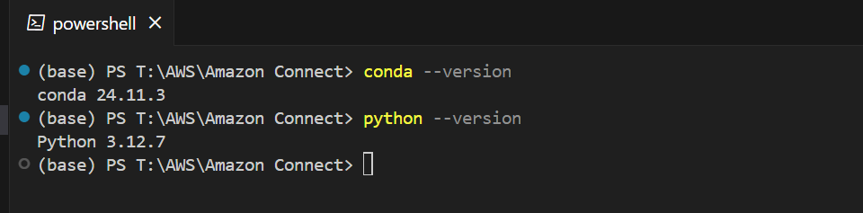
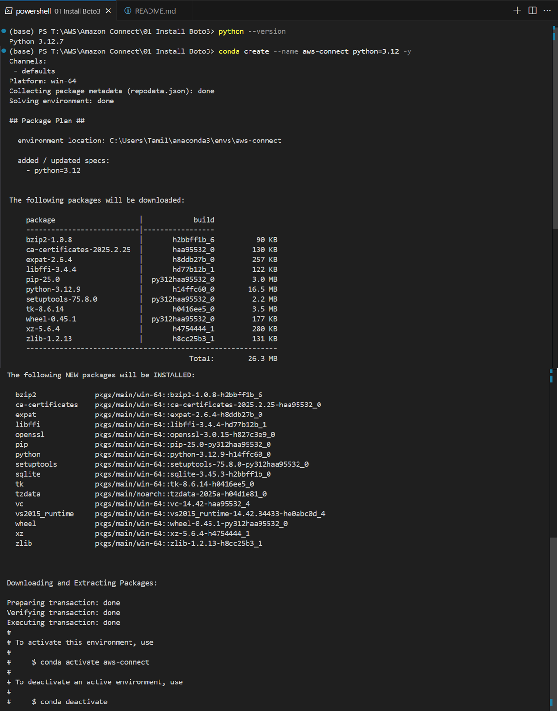
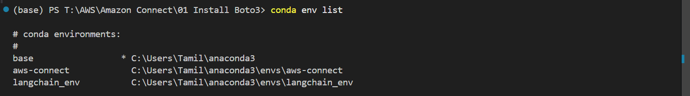
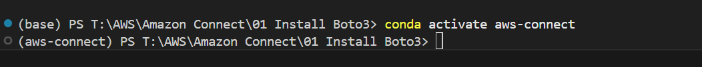
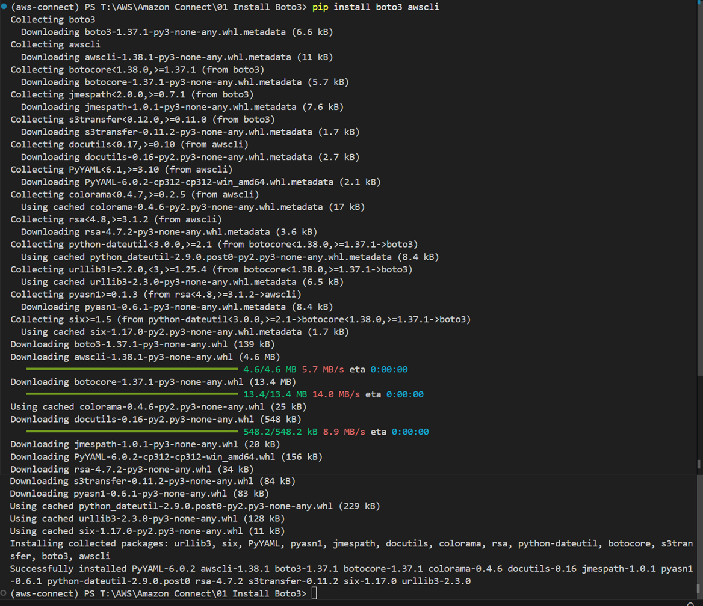
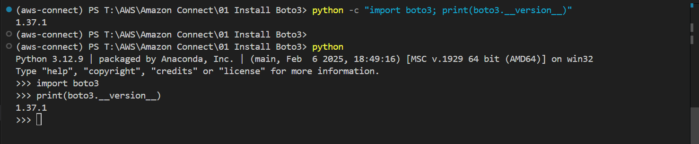
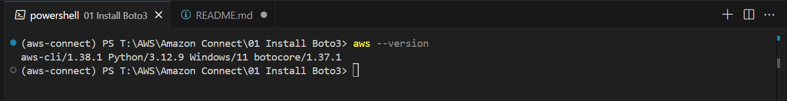

Install Boto3 using PIP for Python
This is the preferred SDK package for Python

Check the conda version and the Python Version
```sh
conda --version
```
```sh
python --version
```


Create a new Virtual env for aws-connect

```sh
conda create --name aws-connect python=3.12 -y

```
Outcome


Check environments

```sh
conda env list

```
Outcome


Activate Env

```sh
conda activate aws-connect

```
Outcome


Install Boto3 and AWS CLI

```sh
pip install boto3 awscli

```
Outcome



Confirm Boto3 Installation

```sh
python -c "import boto3; print(boto3.__version__)"

```
Outcome


Confirm AWS version

```sh
aws --version
```
Outcome
