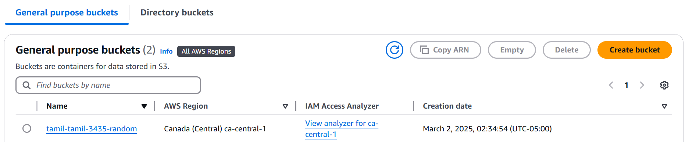

Execute S3 Bucket Creation
```js
provider "aws"{
    profile = "terraform-user"
}

resource "aws_s3_bucket" "tf_aws_s3_bucket" {
    bucket = "tamil-tamil-3435-random"
  
}
```

# Terraform Init

```sh
terraform init
```


# Terraform plan

```sh
terraform plan
```


# Terraform Apply

```sh
terraform apply
```


# AWS Console Outcome


# Terraform Destroy

```sh
terraform destroy
```

